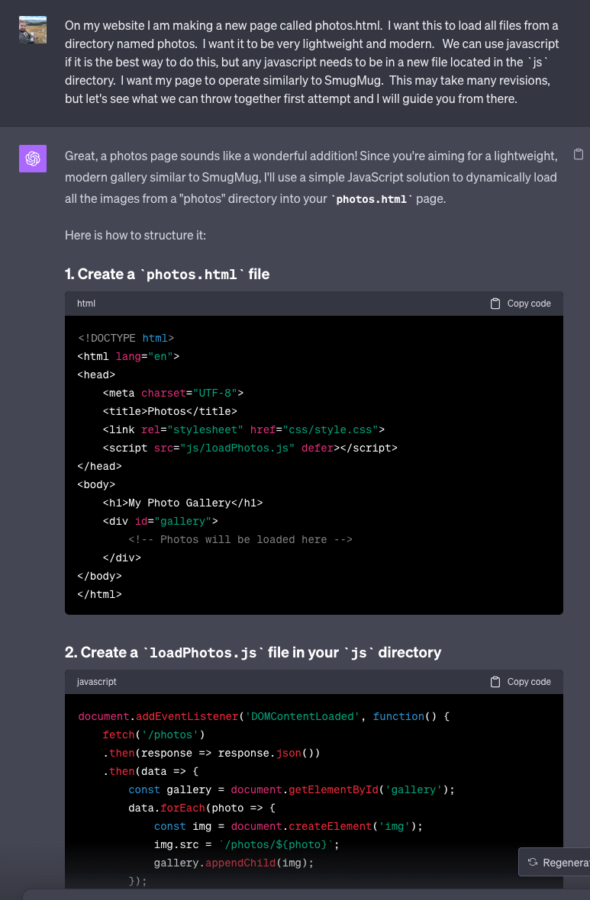

title: did chatgpt save my career?
date: 10-13-2023
category: technology
tags: technology, ai

i work in tech. i'm not entirely sure what exactly my job title is these days, but i call myself a devops engineer. i'm much more "ops" than i am "dev" though. i like to think of myself as pretty creative and full of ideas for projects for weird one-off tools that didn't exist before. web development has always been the most terrifying thing to me. so why haven't i simply learned web development? it's not that i don't think i am capable of it. i think it's because it's intimidating. when i was 14-15 during one of our many trips to duluth, my grandparents got me a book called 'HTML for Dummies.' that was pretty simple, but it never really took off for me. i've had the desire to build these tools and web applications, but i just never have been able to do it. i tried to learn react, and spent a good amount of time messing with it, but i think that's just because a coworker pushed the latest web framework on my and i didn't really understand why we need it. trying to build a photography portfolio to show off my work from the past few years always ended the same way - me abandoning it after trying to google the most simple thing pushed multiple frameworks, languages, specifications, and tech stacks on me. it's just too much. there's too much junk out there.

so, last week i finally built my [photo portfolio](https://mnowls.com/photos.html) in a day, without complex frameworks, and with just a couple files. it works just like i want it to. i will spend $30 to get chick-fil-a doordash when i am hungry, but paying the small monthly fee a service like smugmug requires doesn't work for me - i just have weird priorities. so, what changed, exactly? i decided to start using chatgpt to write my code. it's good. it's really freaking good and it feels like cheating. this technology is going to change everything, but that's a post for another day. as i said earlier, i am a creative person with a lot of ideas that just can't sit down and write the code. this tool has changed my life in the last couple weeks. it's like i can watch my ideas come to life and i just need to be smart enough to know how to put them all together. i understand the code being written by chatgpt and i can troubleshoot and modify it, so i don't feel like i'm doing myself a disservice by using this. my job in tech for the last ~7 years has been finding ways to automate things and large language models are the next step in that. i still have the skillset to connect everything together, i can just be efficient now and i love it.

using chatgpt to generate code:

"but holden, you still haven't mentioned how this has saved your career!" well, the way i see it is that for the past few years the passion i used to feel about tech was all but gone. i've been in a rut. computers are what i've done for a long time, and as i've traveled down other paths in life, i've become more and more disinterested in tech. though i've somehow managed to keep my career in tact, i don't feel like that 'go-getter' i once felt like. i work on a team with three people and we're all pretty disconnected from each other and i haven't felt much of a 'drive' to better myself. chatgpt has become my teammate - i can focus less on writing lousy code and let chatgpt generate good code. i can then test that code, learn, and revise. i feel like that person i did years ago when i first started getting into devops. i'm having fun again. i have a way to see my ideas come to life that don't take months of my time. i love what i am doing again. i am not sure where the future will take me, but for now i think i am finally feeling a sense of fulfillment from tech again.

i really hope to keep traveling down this path and actually creating things. i hope i can keep up with this blog and spending less time doomscrolling social media. less time worrying about engagement and wanting people to like me. more time creating things i've wanted to for the longest time. i still don't believe tech is my calling in life - i think nature photography, exploration, and conservation is what i was put on this planet for, but until someone wants to give me heaps of money to do that, i can't abandon tech.

early next week i plan to write a post about my thoughts on this ai-driven world we're transitioning to. i've sung its praises for what it's done for me here, but it's also a huge source of negative thoughts that are slowly driving me mad and i have a lot to say about it.