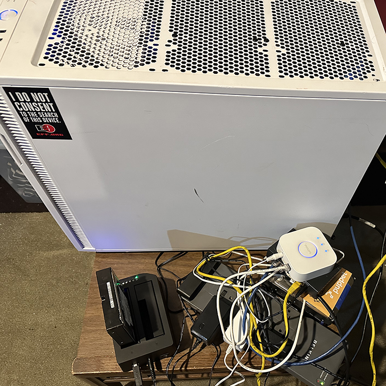
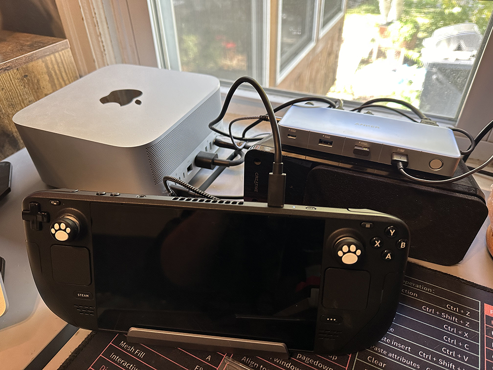

title: Mac Gaming: Almost 😠
date: 10-17-2023
category: Technology
tags: Technology, Review, Apple, The Binding of Isaac, Steam Deck, Mac

Ever since I was in high school, PC gaming had been an enormous part of my life. Diablo II was the first game that pulled me in which eventually led me to Warcraft III which led me to Dota, World of Warcraft, League of Legends, and more. It isn't until recent years that I've really started playing far fewer video games and focusing more on hobbies that allow me to create instead of mindless indulge and hope for dopamine hits from doing well in games. Perhaps if I had been just a little bit better at games, it could have led me down a path of professional competitive gaming, as I've always been very in touch with that scene, but it's not where life led me. PC gaming always required me to have, well, a PC.

When I was in college for computer networking in 2010ish, I knew everything there was to know about computers ever, and my opinion was never wrong. Android was the only answer for cell phones, Apple made terrible and overpriced computers, and anyone that used them was an idiot with more common sense than money. In 2023, I am writing this from my Mac Studio using images from my iPhone that I seamlessly transferred over with one button. It turns out I didn't know everything back then and a lot has changed, except maybe for me still thinking I know everything. 

So, what changed that finally led me down the path of being an Apple fanboy? It's really been a series of events over the last decade. My friend Jesse initially let me try out his MacBook when we were studying for our Red Hat certifications together and I instantly fell in love with it. It was so light and sleek, and that was just the appearance. When he taught me about how spaces work, it was only a couple weeks later when I bought my first MacBook. Maybe Windows has some feature that rivals spaces, but I never found it in my 20+ years on that platform. I won't go down the rabbit hole of spaces, but just know it makes me feel like I have as many monitors as I need on any Mac that I use. Spaces alone are great, but it's their integration with the laptop/magic mouse trackpad that is a game changer. Even back then, it was so ahead of its time. The gestures were extremely intuitive and I the increase in productivity from any other operating system I have ever used was immense. 

You might be wondering why I didn't switch my daily driver sooner if I was so infatuated with Apple, and that answer is simple... gaming! Most games I played were not supported on the Mac, and if they were, the performance would be nothing like it is on my desktop. Since gaming is not as big of a part of my life now, it was easier to make the switch. One game I still do love to play is The Binding of Isaac, which is a great game for me to dive a little deeper into my experience switching to Mac with. It turns out the latest version of TBOI does **not** work on my new computer natively. I wasn't too distraught when I found this out, as I figured I could use the Proton emulation technology to run it on my computer. Wrong! Proton doesn't work on the Mac either! I was pretty frustrated at this point since I had already moved my desktop into the basement and put Red Hat 9 on it and nuked my Windows SSD. I discovered a product called Crossover that allowed me to play Isaac on my computer, great! Well, it turns out with Crossover you only get a 14 day trial and then they want $80, enough money to buy Isaac a few times over. I played it like that through the trial period, and I'd say a solid 25% of my runs ended in my game crashing, so I decided not to spend the money.

I was frustrated, but I still had options. I could stop playing any video games that didn't work on my desktop, which probably would not be the worst thing for me, but that would feel like admitting defeat. I could spend weeks trying to learn how to import the game in WINE and make it work, but Crossover essentially already did this and the experience sucked. If the professionals couldn't do it right, what makes me think I could? I could make a Windows virtual machine on my desktop, but nobody wants to play games on a virtual machine and if I'm going that far, I may as well build another windows computer. This left me with one other option... throw money at the problem.

So, instead of trying to keep fitting a square peg into a round hole, I bought a Steam Deck from Facebook Marketplace. It cost me $500 used for the version that came with a 1TB SSD. That was a decent deal - I could probably sell it for $600 or more. The deck was honestly the perfect solution for me. It's a small fairly powerful computer that looks a lot like the Nintendo Switch. It's got a USB-C port for charging or hooking all of your junk up to, and a MicroSD card slot in case you run out of memory. The part that still blows my mind is that it runs SteamOS under the hood. That's not super mind blowing when I present it like that, but what is is that SteamOS is based on Debian Linux. In the year 2023, my gaming computer runs Linux, and it does it well. Linux gaming has always been a joke, but now that Proton exists, it's completely viable for nearly any title that runs on Steam, and that's amazing to me. Emudeck is also a thing that exists that allows the Deck to emulate nearly any console. This in itself is not illegal - what is illegal is downloading the ROMs for games that you do not own. For someone like me that has tons of old game cartridges lying around, having a handheld system that I can play games I own on anywhere I would like is amazing. Playing through old Pokemon games, Nintendo games, Final Fantasy PS1 games, and whatever else I can think of should be a really good nostalgia trip some day. 

I guess my conclusion is that even though I'm a die-hard Apple fanboy these days, the best way to play some games on a Mac is still not to play them on a Mac. I plan to write more about my experience on Mac later on, but this is the one I felt like sharing today.