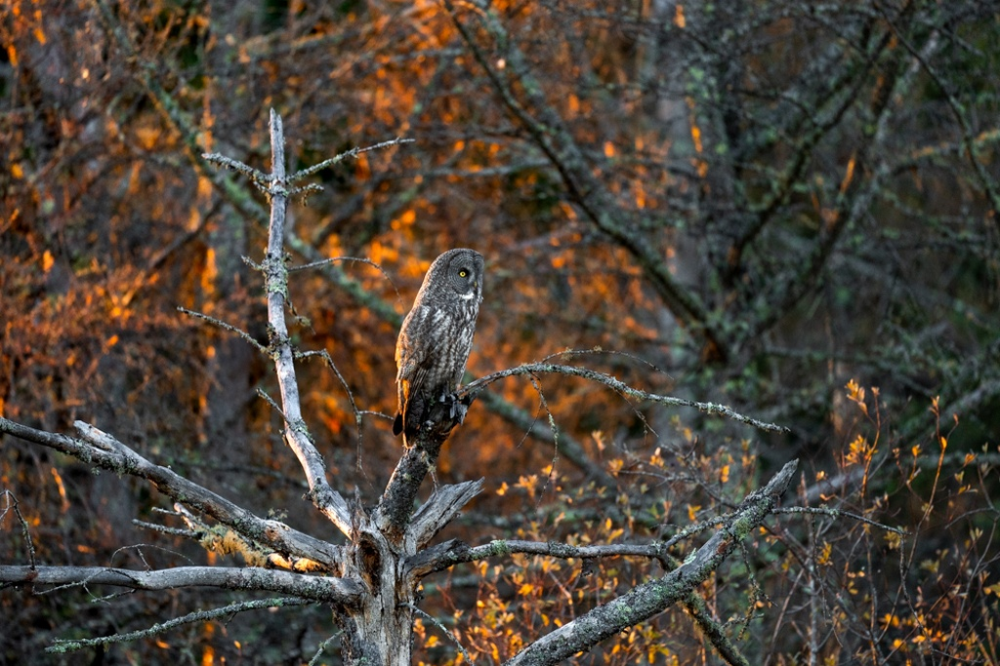

title: Great Gray Owls in Minnesota - 2021
date: 2023-10-20 15:17
category: Wildlife
tags: wildlife, owls, photography, reflection

I spent some time this afternoon looking through all of the pictures I took in 2021 and realized just how good of a year that was. I didn't have top end equipment, but I had good equipment. I was very new in my photography journey, and didn't always think about everything when composing my shots and often made mistakes, but one thing is evident when looking through those photos - 2021 was amazing.

Great gray owls are among my favorite subjects in the world to photography, beaten out only by barn owls and tornadoes. This most recent winter I had a terrible time trying to find them. I haven't seen once since January, though there are some around, but this time of year it's hard. The closer we get to winter, the more of them migrate south to join our resident great grays in northern minnesota. Deep snow cover in the forest forces the owls to hunt roadside in the winter where snow levels are lower and they can easier catch their prey. A higher volume of owls along with them being pushed to more visible locations is what makes winter the primary owl observation season. 

You really never know what you're going to end up getting during the winter in regards to what owls will migrate south from Canada. Winter 2023/2024 could be my best year yet, or it could be a repeat of last winter, which left me wanting so much more than I was given. It's not always easy to find the time to drive 4 hours north and look for owls, and when you do they may show up a mile from where you spent all morning looking. When that happens, someone on social media may later post about their amazing experience photographing owls while you were driving around frustrated and unable to find anything. Without a lot of teamwork, it's a gamble. With teamwork you end up with a crowd of photographers and birders, which some people may treat as a fun social experience. The crowds of photographers, even if they are close friends, sully the experience for me. It's hard to put into words, but whether I am out photographing owls or on the side of a dirt road watching a tornado, I feel a connection to nature, a sort of zen nothing else can bring me. It's really easy to shatter this zen by feeling the social pressure to interact or compete for the best angles in a large crowd.

I didn't really give it my all last year - I didn't try as hard as I could or make as many trips north as I had previous years. Given my success prior years, I didn't feel the motivation to go out and capture the best moments I could. This year I am feeling the hunger in a way I haven't in a long time. This winter I want to take my best wildlife photos ever. It's a difficult goal because with each great capture it becomes difficult for the next one to top that. To give myself a little credit here - it's difficult to feel inspiration in a year where you're not given that much to work with.

I guess this is a promise to myself that I will put the time in. I will load the 4runner up with winter survival gear and spend as many weekends up north as I possibly can with a renewed motivation I haven't felt in a long time. 